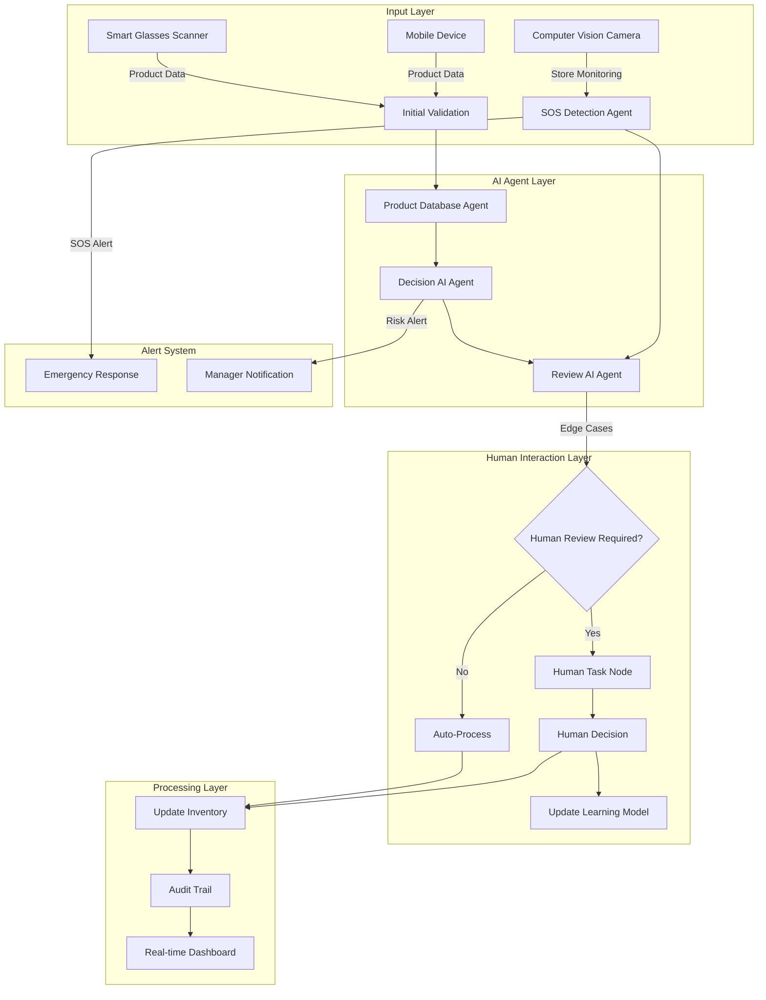

# Annual Pharmacy Inventory Automation Design

## 🎯 Project Overview

Automate annual pharmacy inventory without closing the store, using AI agents, computer vision, and human-in-the-loop workflows to handle complex edge cases while maintaining accuracy and safety.

## 🏗️ Architecture Overview



## 🤖 AI Agents Design

### 1. Product Database Agent
**Purpose**: Maintain comprehensive product knowledge base

```javascript
const ProductDatabaseAgent = {
    capabilities: [
        "Product identification",
        "Historical data analysis",
        "Expiry pattern recognition",
        "Stock level predictions"
    ],
    
    dataStructure: {
        productId: "string",
        name: "string",
        category: "string",
        manufacturer: "string",
        historicalExpiry: ["dates"],
        typicalShelfLife: "number",
        criticalThresholds: {
            minStock: "number",
            maxStock: "number",
            reorderPoint: "number"
        },
        riskFactors: ["string"],
        specialHandling: "boolean"
    },
    
    functions: {
        identifyProduct: async (scanData) => {
            // AI-powered product matching
            // Handle partial/damaged barcodes
            // Fuzzy matching capabilities
        },
        
        predictExpiry: async (productId, batchInfo) => {
            // ML model for expiry prediction
            // Based on historical patterns
        },
        
        assessRisk: async (product) => {
            // Evaluate product-specific risks
            // Flag for human review if needed
        }
    }
};
```

### 2. Decision AI Agent
**Purpose**: Make intelligent decisions on inventory actions

```javascript
const DecisionAgent = {
    decisionTree: {
        "EXPIRED_PRODUCT": {
            action: "QUARANTINE",
            requiresHuman: true,
            urgency: "HIGH"
        },
        "NEAR_EXPIRY": {
            condition: "daysUntilExpiry < 30",
            action: "FLAG_FOR_SALE",
            requiresHuman: false,
            urgency: "MEDIUM"
        },
        "DAMAGED_PACKAGE": {
            action: "HUMAN_REVIEW",
            requiresHuman: true,
            urgency: "HIGH"
        },
        "UNUSUAL_QUANTITY": {
            condition: "quantity > historicalMax * 2",
            action: "VERIFY_COUNT",
            requiresHuman: true,
            urgency: "MEDIUM"
        },
        "MISSING_PRODUCT": {
            action: "INVESTIGATE",
            requiresHuman: true,
            urgency: "HIGH"
        }
    },
    
    evaluateScenario: async (scanData, productInfo) => {
        // Complex decision logic
        // Return action plan with confidence score
    }
};
```

### 3. Review AI Agent
**Purpose**: Double-check decisions and ensure accuracy

```javascript
const ReviewAgent = {
    validateDecision: async (decision, context) => {
        // Cross-reference with regulations
        // Check for logical inconsistencies
        // Validate against business rules
        return {
            approved: boolean,
            confidence: number,
            concerns: [],
            suggestedActions: []
        };
    },
    
    learnFromFeedback: async (decision, humanOverride) => {
        // Update ML models based on human corrections
        // Improve future decision-making
    }
};
```

### 4. Computer Vision SOS Agent
**Purpose**: Monitor store for safety and emergency situations

```javascript
const ComputerVisionAgent = {
    capabilities: [
        "Spill detection",
        "Crowd monitoring",
        "Suspicious activity",
        "Fire/smoke detection",
        "Product falling",
        "Customer distress"
    ],
    
    monitorStore: async (videoFeed) => {
        // Real-time video analysis
        // Object detection and tracking
        // Anomaly detection
        return {
            alerts: [],
            confidence: number,
            screenshot: base64,
            location: coordinates
        };
    },
    
    prioritizeAlerts: (alerts) => {
        // Sort by urgency and impact
        // Filter false positives
    }
};
```

## 👤 Human-in-the-Loop Integration

### n8n Human Task Node Configuration

```javascript
{
    "type": "n8n-nodes-base.humanTask",
    "name": "Review Complex Case",
    "parameters": {
        "taskType": "inventory_decision",
        "assignTo": "{{ $json.recommendedReviewer }}",
        "priority": "{{ $json.urgency }}",
        "timeout": "5m",
        "interface": {
            "displayData": [
                "productInfo",
                "scanImage",
                "aiRecommendation",
                "historicalData"
            ],
            "actions": [
                {
                    "id": "approve",
                    "label": "Approve AI Decision",
                    "color": "green"
                },
                {
                    "id": "override",
                    "label": "Override Decision",
                    "color": "orange",
                    "requiresReason": true
                },
                {
                    "id": "escalate",
                    "label": "Escalate to Manager",
                    "color": "red"
                }
            ]
        },
        "mobileNotification": true,
        "smartGlassesAlert": true
    }
}
```

## 🔍 Edge Cases Handling

### 1. Damaged Products
```javascript
if (product.condition === 'damaged') {
    // Capture photo evidence
    // Assess damage severity
    // Determine if sellable at discount
    // Log for insurance/supplier claims
}
```

### 2. Mismatched Quantities
```javascript
if (Math.abs(scannedQty - systemQty) > threshold) {
    // Trigger recount
    // Check for theft patterns
    // Review transaction history
    // Alert security if needed
}
```

### 3. Recalled Products
```javascript
if (product.isRecalled) {
    // Immediate quarantine
    // Generate recall report
    // Notify authorities
    // Track affected batches
}
```

### 4. Controlled Substances
```javascript
if (product.isControlled) {
    // Double verification required
    // Check authorization
    // Detailed audit logging
    // Regulatory reporting
}
```

### 5. Temperature-Sensitive Items
```javascript
if (product.requiresColdChain) {
    // Verify storage conditions
    // Check temperature logs
    // Assess viability
    // Document chain of custody
}
```

## 📊 Explanatory Blocks System

### Block Documentation Structure
```javascript
const WorkflowBlock = {
    id: "unique-block-id",
    name: "Human-Readable Name",
    purpose: "Clear explanation of what this block does",
    
    documentation: {
        whatItDoes: "Detailed description",
        whyNeeded: "Business justification",
        howItWorks: "Technical explanation",
        
        inputs: {
            required: ["field1", "field2"],
            optional: ["field3"],
            examples: {}
        },
        
        outputs: {
            success: {},
            failure: {},
            edgeCases: {}
        },
        
        errorHandling: {
            retryLogic: "explanation",
            fallbackBehavior: "explanation"
        }
    },
    
    visualGuide: {
        icon: "icon-name",
        color: "#hexcolor",
        helpVideo: "url",
        interactiveDemo: "url"
    }
};
```

## 🚀 Implementation Phases

### Phase 1: Core Infrastructure (Weeks 1-2)
- Set up n8n with human task nodes
- Configure basic webhook endpoints
- Implement product database structure
- Create basic scanning workflow

### Phase 2: AI Agent Integration (Weeks 3-4)
- Deploy product database agent
- Implement decision agent logic
- Set up review agent
- Create feedback loop system

### Phase 3: Computer Vision (Weeks 5-6)
- Install camera systems
- Configure vision AI models
- Set up SOS detection
- Test emergency responses

### Phase 4: Human Interaction (Weeks 7-8)
- Design mobile/web interfaces
- Configure notification systems
- Train staff on edge cases
- Create escalation procedures

### Phase 5: Testing & Optimization (Weeks 9-10)
- Run pilot in store section
- Gather feedback
- Optimize AI models
- Refine human workflows

## 🎯 Success Metrics

### Efficiency Metrics
- Time per product scan: < 3 seconds
- Human intervention rate: < 5%
- Inventory completion time: 50% reduction
- Store operational hours maintained: 100%

### Accuracy Metrics
- Product identification accuracy: > 99.5%
- Expiry date detection: > 99%
- Quantity accuracy: > 99.8%
- False positive rate: < 1%

### Safety Metrics
- SOS response time: < 30 seconds
- Emergency detection rate: > 95%
- Staff satisfaction: > 90%
- Customer disruption: < 5%

## 🛡️ Risk Mitigation

### Technical Risks
- **AI Model Failure**: Fallback to human review
- **Network Outage**: Offline mode with sync
- **Hardware Failure**: Backup devices ready
- **Data Corruption**: Real-time backups

### Business Risks
- **Customer Interference**: Clear signage and barriers
- **Staff Resistance**: Comprehensive training
- **Regulatory Issues**: Compliance pre-check
- **Cost Overrun**: Phased implementation

## 💡 Next Steps

1. **Prototype Development**
   - Build minimal viable workflow
   - Test with subset of products
   - Gather initial metrics

2. **Stakeholder Buy-in**
   - Demo to management
   - Show ROI projections
   - Address concerns

3. **Technology Stack Selection**
   - Choose AI platforms
   - Select computer vision solution
   - Finalize integration tools

4. **Training Program**
   - Create staff materials
   - Design simulation scenarios
   - Plan certification process

This design ensures your annual inventory runs smoothly while the pharmacy stays open, with AI handling routine tasks and humans managing complex decisions! 